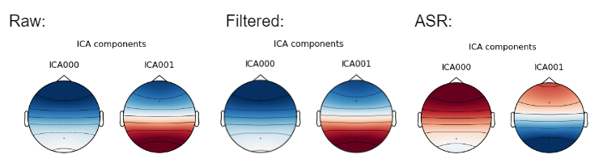
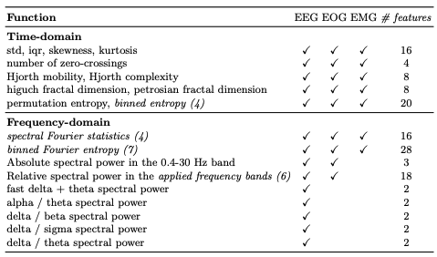
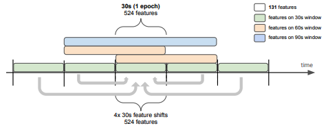

# README

# **Sleep Stage NREM1 Detection Using Machine Learning Models**

# Introduction

### Overview

We create a model that can detect the N1 stage of sleep, and it improves the accuracy of the N1 sleep stage by modifying the training dataset.

### Purpose

This model aims to collect labeled data through EEG for the development of a nap-related mobile application.

### Functionality

The function of this model is to detect the N1 sleep stage.

### Key Features

The model we trained performs better in the detection of N1 compared to existing models.

# Dataset

- Data Description
    - The dataset we use is the Sleep Casstte Study of **[Sleep-EDF](https://www.physionet.org/content/sleep-edfx/1.0.0/)** dataset, consisting of 153 files of 20 hours PSGs record. It used a modified Walkman-like cassette-tape recorder to record the data and were manually scored by well-trained technicians according to the Rechtschaffen and Kales manual. The data includes 7 channels (2EEG, 1EOG, 1EMG, Oro-nasal airflow, Rectal body temperature, Event marker). EOG and EEG signals were each sampled at 100 Hz while EMG, Oro-nasal airflow, rectal body temperature and the event marker were sampled at 1Hz.
    
- Quality Evaluation: Justify the reliability and credibility of the data source
    - Survey and analyzing existing literature
        - The data used in this study was collected from ambulatory polysomnograms of 74 subjects from 26 to 101 years of age recorded in an earlier study. The subjects were recruited from the local population in the period 1989-1991. All subjects had a half-hour interview and another half-hour medical/neurological examination by a neurologist/psychiatrist.
        - The sleep stage analyses were based on Rechtschaffen and Kales NREM sleep stages, which are widely used in sleep research. Additionally, the study was conducted by researchers from Leiden University Hospital and Leiden State University, both of which are reputable institutions.
    - Analyzing the hidden independent component within EEG using ICA with
        - Results:
        
        
        
        
        
        - Due to the limited electrode setup in our EEG data, which only recorded Fpz-Cz and Pz-Oz channels, we simulated their positions as Fz and Pz, respectively. As a result, their ICLabel was categorized as "Other.”

# Model Framework

- Architecture and Component of BCI System
- Input / Output Mechanisms
    
    The input to the model requires four signals: EEG Fpz-Cz, EEG Pz-Oz, EOG horizontal, and EMG submental.
    
    After going through the training process, we can eventually obtain a response that includes an estimator, which can be used to identify N1.
    
- Signal Preprocessing Techniques
    - Data Segmentation Methods
        
        Due to the vast amount of original data and our primary interest in detecting N1, we will first extract all N1 segments from the dataset, as well as the sleep stages before and after N1 (see `make_clip.py` file). Subsequently, we will create an epoch every 30 seconds.
        
    - Artitfact removal Strategies
        
        The literature references we found suggest that EEG and EOG signals in the range of 0.3-40hz are more beneficial for sleep detection. Therefore, we first use a bandpass filter to extract signals in the 0.3-40hz range. As for the EMG, we retain signals in the 0.5-10hz range.
        
    - Feature Extraction Approached
        
        We referred to the paper titled "Do Not Sleep on Traditional Machine Learning," from which we extracted 131 features from the time-domain and frequency domain.
        
        
        
        Subsequently, we collected the aforementioned features for different window durations of 30s, 60s, and 90s, and also incorporated features from the previous and following epochs. Therefore, for a single epoch, there would be a total of 1048 features.
        
        
        
- Machine Learning Model Utilized
    
    Before training, we first use sklearn's SimpleImputer to fill in missing values, and use QuantileTransformer to scale the data to the same scale (n_quantiles=100, subsample=200_000, random_state=0).
    
    The model employs the SGDClassifier, setting the following parameters:
    
    - `loss`: Uses log loss.
    - `class_weight`: Set to "balanced," which will automatically adjust weights according to the frequency of class occurrence.
    
    Finally, we use a cross-validation method for training. We use Group10Fold, which divides the data into 10 folds, and evenly distributes data from each class into each fold. Subsequently, we train the SGD Classifier using different folds as the Test Set.
    

# Validation

We compare the performance of the original dataset and the preprocessed dataset after applying a linear model in terms of Accuracy, Precision, Recall, and F1-score.
Accuracy is a metric that evaluates the overall predictive ability of the model. Precision measures the accuracy of the model in predicting positive instances. Recall measures the model's ability to detect positive instances. F1-score is used to balance the trade-off between Precision and Recall.

# Usage

The required packages include: `pandas`, `numpy`, `plotly`, `tqdm`, `scipy`, `sklearn`, `tsflex`, `antropy`, and `yasa`. You can directly create a conda environment using `BCI_2023.yml`.

You can replace the input data with different files in the `data`'folder (restricted to `*.edf` files, which must contain two EEG channels, one EOG, and one EMG Channel). You can change the file path in the fifth cell of the `*-preprocess.ipynb`file.

### How to execute the code？

1. Download the `/feature` and `/data` folders from the [Google Cloud](https://drive.google.com/drive/folders/1UAliHu4a-QKOtyOaYDv2AS70B4ORVUDu) and place them in the root directory.
    
    ```
    - root/
    	- data/
    	- features/
    	- models/
    	- preprocess/
    	- src/
    	- training/
    	- ...
    ```
    
2. Unzip the files in `/feature` and `/data` folders
3. Use the command below to create a conda environment.
    
    ```
    conda create --name BCI_2023 python=3.8
    ```
    
- Training Steps:
    1. Run `preprocess/SleepEDF-SC-Clip_preprocess`
    2. Run `training/SleepEDF-SC-Clip_training` or `training/SleepEDF-SC-Clip-2class_training`
- Testing Steps:
    - Run `preprocess/SleepEDF-SC-Clip_preprocess`
    1. Run `testing/SleepEDF-SC-Clip_testing` or `testing/SleepEDF-SC-Clip-2class_testing`

# Result

Compare and contrast your BCI system with existing competing methods.

We tested several different datasets with the Linear Model, including the original Sleep-EDF, extracted W→N1→? segments, and data filtered and processed by ASR. As for SleePyCo, due to the lengthy training time required, it wasn't feasible to test various datasets, so we only compared its results using the original Sleep-EDF.

The below tables are the result of our method (clip, clip+bandpass, clip+ASR, clip+2Classes) compare to the existing method (Linear Model, SleePyCo)

- For all Sleep Stage
    
    
    |  | SleePyCo | Linear Model | Clip | Clip + bandpass | Clip + asr |
    | --- | --- | --- | --- | --- | --- |
    | Accuracy | 84.6% | 80.2% | 👑 85.7% | 85.4% | 85.4% |
    | Precision | 85.1% | 80.0% | 78.0% | 79.0% | 78.0% |
    | Recall | 77.9% | 81.0% | 70.0% | 70.0% | 70.0% |
    | F1-score | 79.0% | 80.0% | 73.3% | 73.4% | 72.6% |
    
    Based on the results shown in the table, after modifying the training data, we observed an increase in Accuracy but a decrease in Precision for all Sleep Stages. This can be attributed to the imbalance in the dataset after extracting N1 segments, where there is a significant reduction in the number of segments belonging to Stage 3, Stage 4, and Stage REM compared to Wake, Stage 1, and Stage 2. Consequently, the training data becomes more unbalanced. In other words, the improvement in Accuracy primarily stems from the higher occurrence probability of Wake, Stage 1, and Stage 2 in the training data, making them easier to predict accurately.
    
- N1 Only
    
    
    |  | SleePyCo | Linear Model | Clip | Clip + 2Class | clip + bandpass | clip + asr |
    | --- | --- | --- | --- | --- | --- | --- |
    | Precision | 61.4% | 50.0% | 58.0% | 👑 85.0%  | 58.0% | 57.0% |
    | Recall | 45.6% | 44.0% | 60.0% | 43.0% | 59.0% | 60.0% |
    | F1-score | 50.4% | 47.0% | 59.0% | 58.0% | 59.0% | 58.0% |
    
    From the above table, it can be seen that compared to the state-of-the-art SleePyCo model, by simplifying the task into a 2-class problem, the Precision for N1 recognition has significantly improved (from 61.4% to 85.0%), while the Recall has only slightly decreased (from 45.6% to 43.0%). Therefore, simplifying the task seems to be a viable approach.
    

# Conclusion & Future Work

We have trained a model that can distinguish N1 sleep stage more accurately, especially after simplifying the task to N1 versus non-N1 recognition, where the Precision has significantly improved. Therefore, automating the annotation of N1 and non-N1 stages appears to be feasible. However, we still face the challenge of data imbalance. Therefore, in the future, we aim to further address the issue of data imbalance and find ways to mitigate its impact on our analysis.

We will continue to try various methods to improve the accuracy of N1 recognition and use this model to label the EEG data we collect ourselves.

# References

1. S. Lee, Y. Yu, S. Back, H. Seo, and K. Lee, “Sleepyco: Automatic sleep scoring with feature pyramid and contrastive learning,” arXiv preprint arXiv:2209.09452, 2022.
2. Van Der Donckt, J. et al. (2022) “Do Not Sleep on Traditional Machine Learning: Simple and Interpretable Techniques Are Competitive to Deep Learning for Sleep Scoring” Biomedical Signal Processing and Control. Available at: [https://doi.org/10.1016/j.bspc.2022.104429](https://doi.org/10.1016/j.bspc.2022.104429)
3. B Kemp, AH Zwinderman, B Tuk, HAC Kamphuisen, JJL Oberyé. Analysis of a sleep-dependent neuronal feedback loop: the slow-wave microcontinuity of the EEG. IEEE-BME 47(9):1185-1194 (2000).
[https://www.physionet.org/content/sleep-edfx/1.0.0/](https://www.physionet.org/content/sleep-edfx/1.0.0/)
4. Goldberger, A., Amaral, L., Glass, L., Hausdorff, J., Ivanov, P. C., Mark, R., ... & Stanley, H. E. (2000). PhysioBank, PhysioToolkit, and PhysioNet: Components of a new research resource for complex physiologic signals. Circulation [Online]. 101 (23), pp. e215–e220.
[https://www.physionet.org/content/sleep-edfx/1.0.0/](https://www.physionet.org/content/sleep-edfx/1.0.0/)
5. Suni, E. (2023, March 2). Stages of Sleep (Dr. nilong vyas, Ed.). Sleep Foundation. [https://www.sleepfoundation.org/stages-of-sleep](https://www.sleepfoundation.org/stages-of-sleep)
6. Célia Lacaux et al. (2021) “Sleep onset is a creative sweet spot”.Sci. Adv.7, eabj5866. DOI:10.1126/sciadv.abj5866
7. Meta AI. Sleep Stage Detection on Sleep-EDF. Paperswithcode. [https://paperswithcode.com/sota/sleep-stage-detection-on-sleep-edf](https://paperswithcode.com/sota/sleep-stage-detection-on-sleep-edf)
